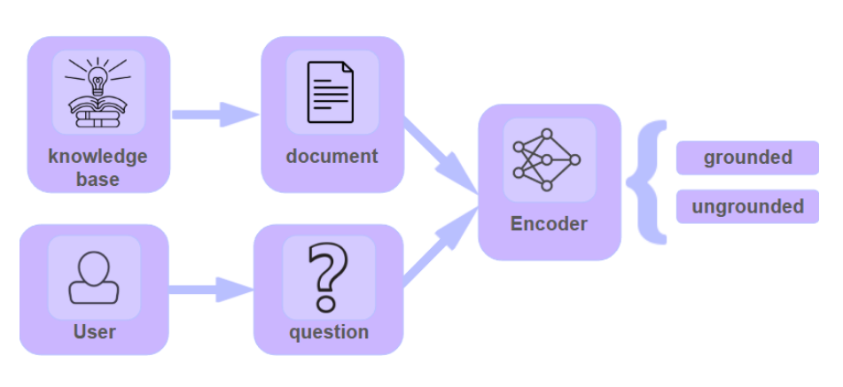
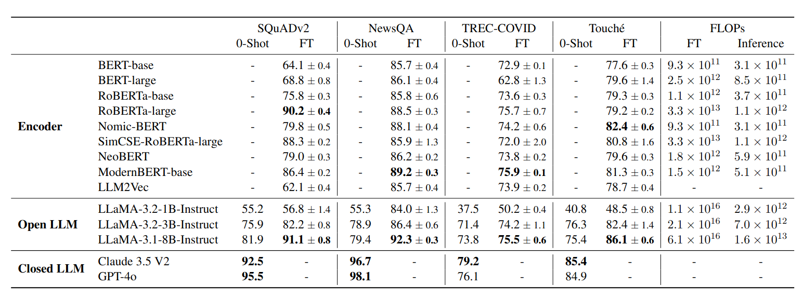

# Small Encoders Can Rival Large Decoders in Detecting Groundedness

## Introduction

Agentic AI systems are quickly becoming the backbone of modern automation. With the Model Context Protocol (MCP), developers can give agents real tools: they can fetch news, query internal databases, or even run code. 

In theory, this should make them grounded and trustworthy as they access real-time information. But in practice, current agents are built on top of large language models (LLMs). And LLMs are storytellers. Even when an MCP tool returns the right answer, the model might ignore it. The output might look noisy, the phrasing might be odd, or the model might simply trust its own "memory" from pretraining more than the tool output.

That happens because [LLMs are trained to predict the next token, not to verify whether a claim is actually backed up by the information provided to them](https://arxiv.org/abs/2403.05612). This is also why they often struggle to simply say "I do not know". Their goal is to keep the conversation going with something that sounds plausible, not to signal uncertainty. As a result, when an agent calls a tool, that information only matters if the LLM actually incorporates it into its response. Without groundedness (i.e., sticking to what the context actually says), users cannot really trust an agent's output. In other words, groundedness is a classification problem ("supported" / "not supported"), not a generative one.

[This joint study between Aily Labs and the Mila AI Institute](https://arxiv.org/abs/2506.21288) explores groundedness detection as a lightweight pre-check before triggering the next costly LLM generation. We show that compact encoders such as [RoBERTa](https://arxiv.org/abs/1907.11692) and [ModernBERT](https://arxiv.org/abs/2412.13663), fine-tuned on curated datasets, can match or even surpass large decoder LLMs like Llama, GPT-4o and Claude Sonnet in detecting groundedness. Crucially, they do so orders of magnitude faster, achieving up to 50× lower latency and 1000× cheaper training. The result: more efficient, interpretable, and sustainable agent pipelines.

<table>
  <tr>
    <td align="center">
      
    </td>
  </tr>
  <tr>
    <td colspan="2" align="center">
      <i>Detecting groundedness before passing the information to the LLM to avoid hallucinations and reduce computational costs.</i>
    </td>
  </tr>
</table>

## Experimental Setup

We frame groundedness detection as a binary classification task. Given a query Q and some context C (like a document retrieved by an agent's tool), we want to predict whether C contains enough information to answer Q. This is a simple "supported" vs "not supported" decision - much simpler than generating a full response.

### Models We Tested

We compared two approaches:

* **Lightweight Encoders:** We fine-tuned compact models like [RoBERTa](https://arxiv.org/abs/1907.11692) (125M parameters) and [NomicBERT](https://arxiv.org/abs/2402.01613) (137M parameters) specifically for this groundedness classification task. These models excel at understanding relationships between text pairs - exactly what we need for comparing queries and contexts.

* **Large Decoder LLMs:** We tested state-of-the-art models including fine-tuned Llama 3 (1B, 3B, and 8B parameters) as well as zero-shot GPT-4o and Claude Sonnet, asking them directly whether a context supports a query with carefully crafted prompts.

### Datasets and Training

We trained and evaluated on diverse datasets to ensure our findings generalize:

- **Question Answering:** [SQuAD v2.0](https://arxiv.org/abs/1806.03822) and [NewsQA](https://arxiv.org/abs/1611.09830), which include both answerable and unanswerable questions.
- **Information Retrieval:** Two datasets from the [BEIR benchmark](https://arxiv.org/abs/2104.08663); TREC-COVID and Touche, testing whether retrieved documents are relevant to search queries.

For the encoder models, we fine-tuned them using standard binary classification training. The models learn to output a probability score indicating whether the context supports the query. We used careful hyperparameter tuning with learning rates around 2e-5, batch sizes of 16-32, and trained for just a few epochs - keeping training costs minimal.

For the LLM baselines, we tested various prompts like "Can you answer the question using the given context? Reply with 'yes' or 'no'" and selected the best-performing ones for each model.

## Results

<table>
  <tr>
    <td align="center">
      
    </td>
  </tr>
  <tr>
    <td colspan="2" align="center">
      <i>Accuracy of encoders and LLMs in groundedness detection for zero-shot and fine-tuned (FT) settings. Fine-tuned encoders perform closely to the best zero-shot LLMs, except on the challenging Touché dataset.</i>
    </td>
  </tr>
</table>

Our experiments reveal several key findings that challenge conventional wisdom about model size and performance.

**Prompt sensitivity:** Zero-shot LLM performance varies dramatically with prompt engineering, especially for smaller models. Testing 20 different prompts, we found Llama 3 1B's accuracy could swing by over 15 percentage points based on wording alone. Even larger models like GPT-4o benefited from careful prompt engineering.

**Fine-tuning delivers consistent gains:** Fine-tuning improves performance by 10-30 percentage points across all model types. For example, Llama 3.1 8B jumped from 81.9% to 91.1% on SQuAD v2.0 with fine-tuning. Crucially, fine-tuned RoBERTa (90.2% on SQuAD v2.0) comes within ~10% of the best zero-shot models like GPT-4o (95.5%) while being orders of magnitude more efficient.

**Model size matters, but architecture matters more:** Larger models do perform better within their architecture type - RoBERTa-Large beats RoBERTa-Base by 12-15 points, and Llama 8B vastly outperforms Llama 1B (74.8% vs 42.1% zero-shot). However, a fine-tuned RoBERTa-Large (355M parameters) can compete with much larger decoder models because encoders are naturally suited for semantic matching tasks like groundedness detection, while LLMs are optimized for open-ended generation.

**Fast Payback on Efficiency:** Encoder models deliver massive inference cost savings that quickly offset fine-tuning expenses. The cost of fine-tuning ModernBERT equals fewer than 5,000 inference queries with Llama 3 8B - meaning the investment pays back almost immediately in high-throughput production systems where you might process thousands of queries daily.

## Conclusions and Future Work

This study demonstrates that lightweight encoder models like RoBERTa and ModernBERT can match larger decoder models in groundedness detection while delivering 50x faster inference and 1000x cheaper training. This makes real-time groundedness filtering practical for production agent systems, preventing hallucinations before expensive generation rather than detecting them afterward.

However, our work focused on single-document scenarios. But what happens when agents need to synthesize information across multiple documents for multi-hop reasoning? How can we detect when contexts contain internal contradictions that might mislead even a well-grounded response?

Future work should tackle these multi-document scenarios and incorporate factual consistency checks to handle contradictory contexts. As agentic systems become more sophisticated, groundedness detection will need to evolve from simple binary classification to more nuanced reasoning about complex, interconnected information sources. The efficiency gains we've demonstrated provide a solid foundation for building these more advanced systems.

Read [the full paper](https://arxiv.org/abs/2506.21288).

# Acknowledgements

This research was authored by Istabrak Abbes1, Gabriele Prato1, Quentin Fournier1, Fernando Rodriguez2, Alaa Boukhary2, Adam Elwood2, and Sarath Chandar1.

**Affiliations:** 1 Mila – Quebec AI Institute; 2 Aily Labs