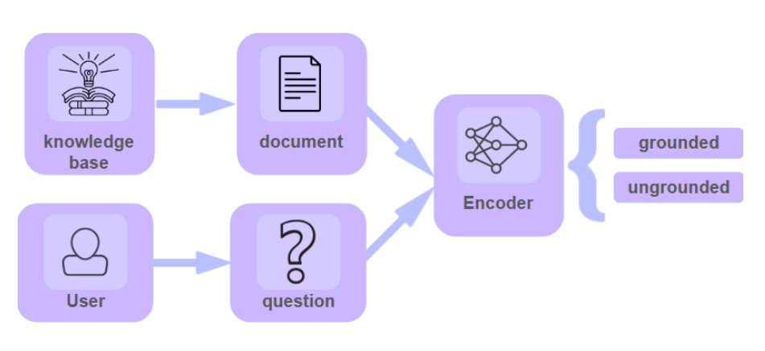
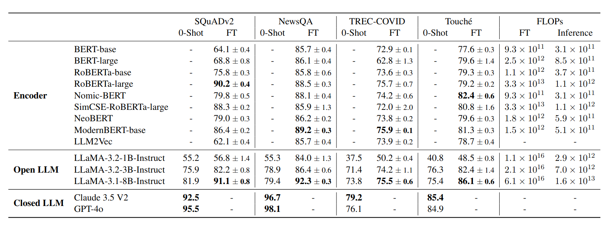

# How To Make Agents Efficient At Catching Their Own Mistakes

*Small, efficient AI models can catch agent hallucinations as accurately as large models, but 50x faster and 1000x cheaper, making real-time verification practical for production.*

## The Problem: Expensive Mistakes

Imagine your AI agent just told your CFO that Q3 revenue was **$200 million** when it was actually **$157 million**. Or assured your operations team that a manufacturing plant has **1,000 units in stock**, when the shelves are empty. Or that your flagship product faces **no current rivals**, even though a competitor just launched a direct alternative. 

At **Aily Labs**, as we deploy AI agents for Fortune 500 companies, we've watched them confidently deliver wrong information *even when they had the right data*. The agent queries the database, retrieves the correct number, and then... makes something up.

**The stakes are real:** A wrong inventory count triggers unnecessary production, a false revenue report influences board decisions, and a missed contract cancellation leaves teams scrambling. In business, AI hallucinations aren't just mistakes; they're expensive ones.

And here's what makes it worse: these agents *had* access to the right information. They should be reliable. Instead, they've become the most confidently wrong employees in your company.

## Why Current Solutions Don't Work

So why does this happen? **Large language models (LLMs) are storytellers, not fact-checkers.** GPT, Sonnet, Llama, and their peers are [trained to predict the next word and keep the conversation flowing, not to verify whether their claims match the information they just retrieved.](https://arxiv.org/abs/2403.05612)

When an agent encounters data that looks "noisy" or unfamiliar, it often chooses what *sounds right* over what *is right*. Now, the obvious fix seems simple: use another LLM to check the first one's work. But that approach fails in production for two reasons:

- **It's expensive.** Doubling model calls doubles costs. For systems processing millions of queries daily, this quickly becomes prohibitive.  
- **It's slow.** Each verification adds seconds of latency. In agentic loops, those seconds compound and kill responsiveness.

Thus, we needed a different approach entirely.

## It's a Classification Problem, Not a Generation Problem

When we ask, *“Is this agent response supported by the provided context?”* we're not asking the model to create new content. We're asking for a binary judgment: **supported** or **not supported**. This concept is often referred to as **groundedness**. This reframe opens up a completely different class of AI models.

While models like GPT, Sonnet, and Llama are **decoder** models that excel at text generation, we can use **encoder** models like [RoBERTa](https://arxiv.org/abs/1907.11692) and [ModernBERT](https://arxiv.org/abs/2412.13663) for this task. These encoder models are specifically designed to understand relationships between pieces of text (exactly what we need for comparing an agent's response against the provided context). And crucially, they're usually much smaller and thus faster.

The result? We can build a verification layer that's orders of magnitude faster and cheaper than using LLMs, while maintaining the same level of accuracy.

<table>
  <tr>
    <td align="center">
      
    </td>
  </tr>
  <tr>
    <td colspan="2" align="center">
      <i>Detecting groundedness before passing the information to the LLM to avoid hallucinations and reduce computational costs.</i>
    </td>
  </tr>
</table>

## Putting It to the Test

To test our hypothesis that small encoder models can efficiently verify groundedness, we ran experiments across multiple domains:

- **Question Answering:** [SQuAD v2.0](https://arxiv.org/abs/1806.03822) and [NewsQA](https://arxiv.org/abs/1611.09830), both containing answerable and unanswerable queries.  
- **Information Retrieval:** Two datasets from [BEIR](https://arxiv.org/abs/2104.08663): **TREC-COVID** and **Touche**, testing document relevance.

We fine-tuned encoder models for the task and compared them against decoder LLMs using carefully optimized prompts.

<table>
  <tr>
    <td align="center">
      
    </td>
  </tr>
  <tr>
    <td colspan="2" align="center">
      <i>Fine-tuned encoder models achieve comparable accuracy to much larger decoder models across multiple datasets.</i>
    </td>
  </tr>
</table>

Some revealing findings:

**Model size matters, but architecture matters more:** Within encoders, RoBERTa-Large beats RoBERTa-Base by 12–15 points across datasets. However, fine-tuned encoders can rival much larger decoder models because their architecture is inherently suited for semantic matching and comparison tasks, not text generation.

**Fine-tuning delivers consistent gains:** Fine-tuning improves accuracy by 10–30 points across all model types. For instance, Llama 3.1 8B jumped from **81.9% to 91.1%** on SQuAD v2.0. Most remarkably, fine-tuned **RoBERTa-Large (90.2%)** came within ~5% of GPT-4o (95.5%) while being *50x faster* in inference and *1000x cheaper* in training.

**Fast payback on efficiency:** Encoder models deliver massive inference cost savings that quickly offset fine-tuning expenses. The cost of fine-tuning ModernBERT equals fewer than 5,000 inference queries with Llama 3 8B, meaning the investment pays back almost immediately in high-throughput production systems where you might process millions of queries daily.

**Prompt sensitivity:** Zero-shot LLM performance swings dramatically with prompt wording (up to 15 percentage points for smaller models like Llama 3 1B). Even GPT-4o benefited from careful prompt tuning, highlighting how sensitive these LLMs are to the exact phrasing of verification tasks.

## Building Trustworthy AI Agents at Scale

Remember that CFO who got told Q3 revenue was $200 million instead of $157 million? With our approach, that mistake would be caught in milliseconds, before it ever reached the executive's screen. The agent would query the database, get the real number, generate its response, and then (in the background) a small, specialized model would verify: "Does the context support this claim?" The answer would be no. The response would be flagged and regenerated. Crisis averted.

This study demonstrates that **small encoder models can match the accuracy of much larger decoder models in detecting groundedness while delivering 50x faster inference and 1000x cheaper training.** More importantly, it makes real-time verification practical for production agent systems, preventing hallucinations before expensive generation rather than detecting them afterward.

The path to trustworthy AI agents isn't about building bigger models or more complex architectures. It's about using the right tool for the job. LLMs excel at generation and reasoning. Small encoder models excel at verification and classification. By combining them intelligently, we can build agent systems that are both powerful and reliable.

As agentic systems become more sophisticated, verification will need to evolve beyond simple binary classification to handle multi-document reasoning and contradictory contexts. But the efficiency gains we've demonstrated provide a solid foundation for building these more advanced systems. When verification is fast and cheap, you can afford to be thorough.

The future of AI agents isn't just about what they can do. It's about **whether we can trust them to do it right.**

---

**Read [the full paper](https://arxiv.org/abs/2506.21288) for technical details and complete experimental results.**

---

*Authored by Istabrak Abbes1, Gabriele Prato1, Quentin Fournier1, Fernando Rodriguez2, Alaa Boukhary2, Adam Elwood2, and Sarath Chandar1.*

*1 Mila – Quebec AI Institute  
2 Aily Labs*
